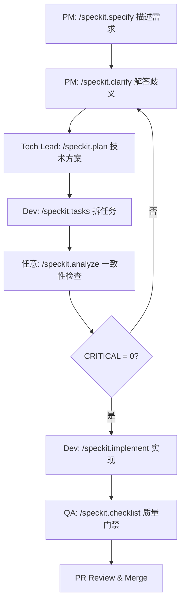

# 贡献指南 — SpecKit 团队协作规范

> 本仓库使用 **Spec-Driven Development (SDD)** 工作流。所有功能开发必须经过 SpecKit 流水线:
> `constitution → specify → clarify → plan → tasks → analyze → implement`。
>
> 本文档定义了团队成员协作时的角色、流程、文档治理与跨 IDE 兼容约定。

---

## 目录

1. [核心理念](#1-核心理念)
2. [角色分工](#2-角色分工)
3. [标准工作流](#3-标准工作流)
4. [分支与命名规范](#4-分支与命名规范)
5. [文档治理:什么进主干、什么清理](#5-文档治理什么进主干什么清理)
6. [跨 IDE 协作约定](#6-跨-ide-协作约定)
7. [PR 准入与 Code Review](#7-pr-准入与-code-review)
8. [常见问题 FAQ](#8-常见问题-faq)

---

## 1. 核心理念

- **Spec 是合同**:`spec.md`、`plan.md`、`contracts/` 一旦合入主干即为团队共识,变更需经评审。
- **流水线接力**:不要每个人都从 `/speckit.specify` 跑到底,按角色接力。
- **Constitution 不可妥协**:`.specify/memory/constitution.md` 中的 MUST 原则违反即 CRITICAL,必须修改 spec/plan/tasks,不得弱化原则。
- **`.specify/` 是单一事实源**:所有 IDE 入口(`.github/agents/`、`.claude/agents/`、`.cursor/rules/` 等)都只是适配层,真正逻辑由 `.specify/scripts/` 与 `.specify/templates/` 承载。

---

## 2. 角色分工

| 角色 | 主要负责的 SpecKit 阶段 | 产出物 | 备注 |
|---|---|---|---|
| **架构师 / Tech Lead** | `/speckit.constitution` | `.specify/memory/constitution.md` | 一次性建立,长期维护,变更需团队评审 |
| **PM / 业务方** | `/speckit.specify` + `/speckit.clarify` | `spec.md` | 聚焦 WHAT/WHY,不涉及技术实现 |
| **资深开发 / 模块 Owner** | `/speckit.plan` + `/speckit.analyze` | `plan.md`、`research.md`、`data-model.md`、`contracts/` | 拆解技术方案,定义接口契约 |
| **开发(可多人并行)** | `/speckit.tasks` + `/speckit.implement` | `tasks.md` + 代码 | 按 User Story 并行实现 |
| **QA / Reviewer** | `/speckit.checklist` + `/speckit.analyze` | `checklists/*.md` | 把关需求质量与一致性 |

**协作原则**:
- 同一个 feature 内,每个阶段尽量由**一个人**主导,避免多人同时跑同一 agent 导致冲突。
- 阶段切换时通过 PR Comment / Issue 显式交接,例如:`@xxx spec 已完成,请接 /speckit.plan`。

---

## 3. 标准工作流

### 3.1 新增 Feature 的完整流程



### 3.2 各阶段产出物清单

| 阶段 | 必须产出 | 可选产出 |
|---|---|---|
| specify | `specs/<id>/spec.md`、`specs/<id>/checklists/requirements.md` | — |
| clarify | 更新 `spec.md` 的 `## Clarifications` 段 | — |
| plan | `plan.md`、`research.md` | `data-model.md`、`contracts/`、`quickstart.md` |
| tasks | `tasks.md` | — |
| analyze | 终端报告(不落盘) | — |
| implement | 代码 + 更新 `tasks.md` 勾选状态 | — |
| checklist | `checklists/<domain>.md` | — |

### 3.3 启动一个新 Feature

```powershell
# 1. 同步 main
git checkout main
git pull

# 2. 在 IDE 中执行(以 Copilot 为例)
#    /speckit.specify "添加用户多因素认证"
#
# 该命令会自动:
#   - 调用 git.feature 钩子创建分支(如 20260319-143022-mfa 或 003-mfa)
#   - 在 specs/<branch-id>/ 下生成 spec.md
#   - 生成 checklists/requirements.md 并交互式补全
```

---

## 4. 分支与命名规范

### 4.1 分支命名策略

在 `.specify/extensions/git/git-config.yml` 中配置:

```yaml
branch_numbering: timestamp   # 团队 ≥ 5 人推荐 timestamp,小团队可用 sequential
```

| 模式 | 示例 | 适用场景 |
|---|---|---|
| `sequential` | `003-user-auth` | ≤ 4 人的小团队,串行特性多 |
| `timestamp` | `20260319-143022-user-auth` | ≥ 5 人或并发特性多,避免编号抢占 |

> **冲突预警**:`sequential` 模式下若两人同时 `/speckit.specify`,可能抢同一 `00X` 编号,需手动协调。

### 4.2 一个 Feature = 一个 PR

- **不要**在同一个特性分支上叠加多个不相关 feature。
- **不要**让特性分支存活超过 2 周;长 feature 拆成多个 spec(P1/P2/P3 拆成多个 PR)。
- 合入 main 前必须 `git rebase main` 或合并最新 main。

### 4.3 Commit 规范

启用 `git.commit` 钩子自动提交各阶段产物:

```yaml
# .specify/extensions/git/git-config.yml
auto_commit:
  default: false
  after_specify:
    enabled: true
    message: "spec: add specification"
  after_plan:
    enabled: true
    message: "plan: add implementation plan"
  after_tasks:
    enabled: true
    message: "tasks: generate task breakdown"
```

人工补充 commit 时遵循 [Conventional Commits](https://www.conventionalcommits.org/):
- `spec:` / `plan:` / `tasks:` / `feat:` / `fix:` / `docs:` / `refactor:` / `test:`

---

## 5. 文档治理:什么进主干、什么清理

SpecKit 会生成大量 markdown,**必须区分"长期资产"与"过程脚手架"**。

### 5.1 文档分类

| 类型 | 文件 | 合入 main? | 说明 |
|---|---|---|---|
| **长期资产** | `.specify/memory/constitution.md` | ✅ | 项目宪章,永久保留 |
| **长期资产** | `specs/<id>/spec.md` | ✅ | 需求合同,作为 ADR 历史 |
| **长期资产** | `specs/<id>/plan.md` | ✅ | 设计决策,后人参考 |
| **长期资产** | `specs/<id>/data-model.md` | ✅ | 数据模型 |
| **长期资产** | `specs/<id>/contracts/**` | ✅ | 接口契约 |
| **过程脚手架** | `specs/<id>/tasks.md` | ❌ 合入前清理 | 已转 Issues 或已实现完毕 |
| **过程脚手架** | `specs/<id>/research.md` | ⚠️ 视情况 | 有长期参考价值则保留 |
| **过程脚手架** | `specs/<id>/checklists/**` | ❌ 合入前清理 | 一次性质量门禁 |
| **过程脚手架** | `specs/<id>/quickstart.md` | ⚠️ 视情况 | 若已纳入正式 README/docs 则删除 |

### 5.2 清理时机

**合入 main 之前**,Owner 必须:

1. 运行 `/speckit.taskstoissues` 把 `tasks.md` 转成 GitHub Issues(若使用 GitHub)。
2. 删除 `tasks.md`、`checklists/`(或移到 `docs/archive/specs/<id>/`)。
3. 在 PR 描述中链接归档位置,便于审计回溯。

### 5.3 归档目录约定(可选)

若需保留全部历史:

```
docs/
└── archive/
    └── specs/
        └── <feature-id>/
            ├── tasks.md
            ├── research.md
            └── checklists/
```

---

## 6. 跨 IDE 协作约定

团队成员可能使用不同的 AI IDE(Copilot / Cursor / Claude Code / Qoder / Windsurf)。**SpecKit 的核心逻辑都在 `.specify/`,IDE 入口只是适配层**。

### 6.1 单一事实源:`.specify/`

| 目录 | 用途 | 是否共享 |
|---|---|---|
| `.specify/memory/` | 宪章等长期记忆 | ✅ 全员共享 |
| `.specify/templates/` | spec/plan/tasks/checklist 模板 | ✅ 全员共享 |
| `.specify/scripts/` | PowerShell + Bash 脚本 | ✅ 全员共享 |
| `.specify/extensions/` | Git 等扩展 | ✅ 全员共享 |

### 6.2 各 IDE 的入口适配层

| IDE | 入口路径 | 由谁维护 |
|---|---|---|
| GitHub Copilot | `.github/agents/*.md` + `.github/copilot-instructions.md` | Copilot 用户 |
| Cursor | `.cursor/rules/*.mdc` | Cursor 用户 |
| Claude Code | `.claude/agents/*.md` + `CLAUDE.md` | Claude 用户 |
| Qoder | `AGENTS.md` + `.qoder/` | Qoder 用户 |
| Windsurf | `.windsurfrules` | Windsurf 用户 |

### 6.3 添加新 IDE 入口

如果你的 IDE 还没有入口,使用官方 CLI 在仓库根目录生成:

```bash
specify init --ai <copilot|cursor|claude|qoder|windsurf> --here
```

它会**只**生成入口文件,不会覆盖 `.specify/`。

### 6.4 跨平台脚本一致性

`.specify/scripts/` 同时维护两套:

```
.specify/scripts/
├── bash/           # macOS / Linux 用户
│   ├── check-prerequisites.sh
│   ├── setup-plan.sh
│   └── ...
└── powershell/     # Windows 用户
    ├── check-prerequisites.ps1
    ├── setup-plan.ps1
    └── ...
```

**规则**:任一边脚本变更必须**同步另一边**。PR 中只改单边视为不合格。

### 6.5 IDE 无关的约定

- 所有路径以**仓库根目录**为基准,文档中使用项目相对路径(`specs/003-xxx/spec.md`),脚本调用使用绝对路径。
- 不在 spec/plan 中写死 IDE 特有的命令(如 `/speckit.xxx`),改写为"运行 specify 命令"等通用描述。
- 共享 `.gitattributes`,统一换行符为 `LF`(避免 Windows 用户提交 CRLF 污染 bash 脚本)。

---

## 7. PR 准入与 Code Review

### 7.1 PR 提交前自检清单

- [ ] `/speckit.analyze` 报告中 **CRITICAL 数 = 0**
- [ ] `specs/<id>/checklists/` 内所有 checklist 项均为 `[X]`
- [ ] `tasks.md` 中所有任务已勾选 `[X]`(或对应 Issue 已关闭)
- [ ] 实现与 `plan.md`、`contracts/` 一致
- [ ] 过程脚手架文档已按 [§5.2](#52-清理时机) 清理
- [ ] 若修改了 `.specify/scripts/`,bash 与 powershell 两版同步更新
- [ ] 若新增了原则/章节,运行了 `/speckit.constitution` 更新版本号

### 7.2 Reviewer 关注点

1. **Spec ↔ Code 一致性**:抽样验证 FR-xxx / SC-xxx 是否真实实现。
2. **Constitution 对齐**:有无违反 MUST 原则。
3. **接口契约**:`contracts/` 变更是否破坏向后兼容(MAJOR 版本需团队评审)。
4. **文档清理**:过程脚手架是否已清理或归档。
5. **跨平台**:`.specify/scripts/` 两套脚本是否一致。

### 7.3 合并策略

- 优先 **Squash merge**,保持 main 干净。
- 大型 feature 用 **Merge commit**,保留阶段性 commit 历史。
- 禁止 **Rebase merge** 到 main(避免重写主干历史)。

---

## 8. 常见问题 FAQ

### Q1: 我不想跑完整流水线,能跳过 clarify / analyze 吗?

可以,但有代价:
- 跳过 `clarify`:下游 plan/tasks 返工概率上升。
- 跳过 `analyze`:CRITICAL 问题会在 implement 阶段暴露,成本更高。

**例外**:探索性 spike / 一次性脚本,可在 PR 描述中标注 `[skip-sdd]` 直接走简化流程,但**不得**合入主干 spec。

### Q2: 两个人同时改同一个 spec 怎么办?

- spec 编辑权归**当前阶段的 Owner**,其他人通过 PR Comment 提建议。
- 若必须协作编辑,先在 Issue 中协商分工(例如:A 改 Functional Requirements,B 改 Success Criteria)。

### Q3: 改动 `.specify/memory/constitution.md` 的流程?

1. 任何人可发起 PR。
2. 必须经过 **Tech Lead + 至少 1 名核心维护者**评审。
3. PR 中包含 `/speckit.constitution` 生成的 **Sync Impact Report**。
4. 版本号 bump 遵循 SemVer(MAJOR/MINOR/PATCH 见 agent 说明)。

### Q4: GitHub Issues 与 `tasks.md` 如何同步?

- 推荐流程:`/speckit.tasks` 生成 → `/speckit.taskstoissues` 转 Issues → 合入 main 前删 `tasks.md`。
- Issue 标题前缀建议 `[<feature-id>] T00X ...`,便于追溯回 spec。

### Q5: 老仓库迁入 SpecKit 怎么办?

1. 运行 `specify init --here` 初始化 `.specify/` 与你的 IDE 入口。
2. 跑 `/speckit.constitution` 把团队已有的规约整理成宪章。
3. 把现存模块文档手工归档到 `specs/000-legacy/` 作为基线。
4. 新 feature 从下一个编号开始走标准流程。

---

## 附录:相关文档

- [SpecKit Agents 大纲](./agents-outline.md) — 每个 agent 的职责与步骤
- [Project Constitution](../.specify/memory/constitution.md) — 项目宪章
- [SpecKit 官方文档](https://github.com/github/spec-kit)

---

**最后更新**:请在每次修订时更新文件顶部的"最后更新"日期,并通过 `/speckit.constitution` 同步至宪章版本(如适用)。
